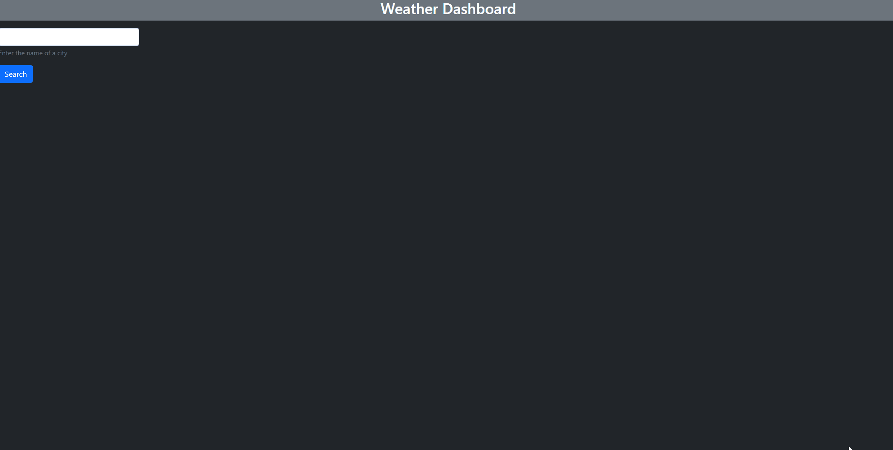

# Module-06: Weather Dashboard

## Description
This is a simple application for displaying the current weather and a five day forecast for any city on Earth. 
Powered by OpenWeather.
## Usage
Simply visit https://dshowarth.github.io/Module-06-Weather-Dashboard/ and start searching! Every new search will give you the weather
and store itself for easy access in the future. (Data stored locally)

## Technologies Used
- HTML
- CSS
- Javascript
- Jquery
- Bootstrap
- DayJS

## Lessons Learned
- When storing entries piecemeal in an array, you need to store the first entry as 
a singular array in order to .push() new entries later
- It is much easier to put an event delegation trigger on the element you're 
dynamically appending new elements onto, rather than create a new trigger for each.
- The more modular you can make your functions, the easier your code will be to work with as it balloons in scope
## Credits
- Weather API provided by https://openweathermap.org/
- Gif captured with https://github.com/NickeManarin/ScreenToGif/
